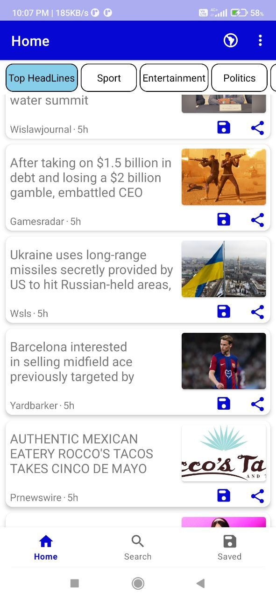
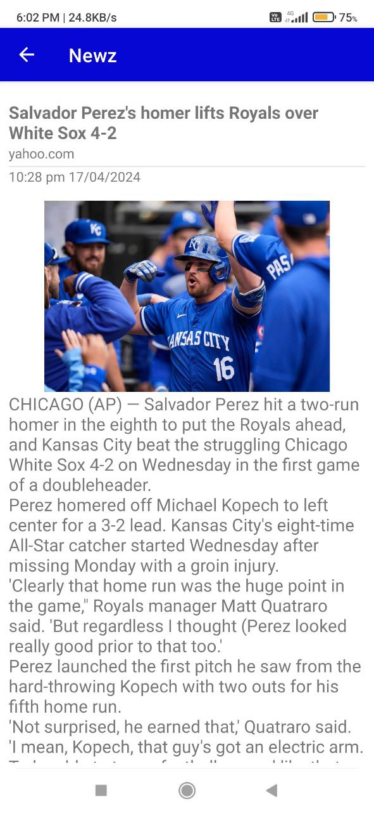
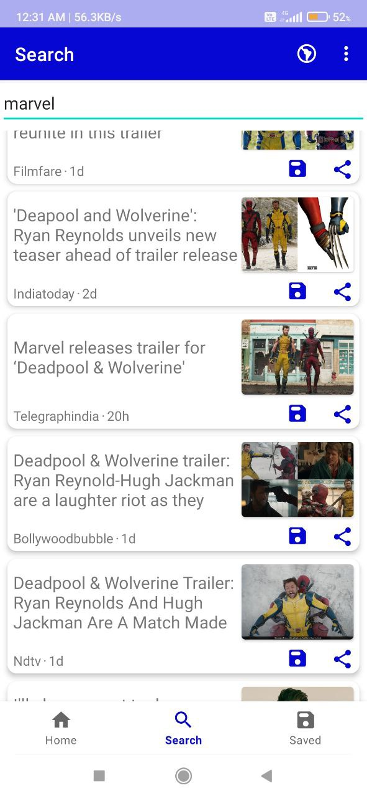

# :newspaper: Newz
### Powered by [</ newscatcher >](https://newscatcherapi.com/)
## App Screenshots
<p align="center">
  
  
  
</p>

## Information
Newz is a dynamic news application powered by the Newscatcher API, offering users an immersive experience in accessing global news. Leveraging Retrofit for seamless API integration, Newz ensures quick and efficient retrieval of news articles from a diverse range of sources.

## Features
- **Comprehensive Coverage:** Access news articles from a wide array of sources, covering various topics and interests.
- **Intuitive Navigation:** Browse news conveniently through Newz's user-friendly interface, designed for effortless exploration.
- **Stay Informed:** Stay updated with the latest headlines across different categories, ensuring you never miss out on important news updates.
  
## Installation

Download my-project from Github

[](https://github.com/TheCodeSmith404/Newz/releases/tag/v1.0)

## Technologies Used
- **Retrofit:** Powering API communication, Retrofit enables smooth interaction with Newscatcher's services, ensuring a seamless news browsing experience.
- **Glide:** Utilizing Glide to load images from URLs, Newz delivers rich multimedia content to enhance your news reading experience.
- **Material Design:** Newz incorporates Material Design principles to provide a visually appealing and consistent user interface, enhancing usability and aesthetics.

## Code Examples
<details><Summary>Recycle View Adapter</Summary>
  
  - Android uses Recycle view or lazy layout(for compose) to populate  large number of items.
  - When working with xml layout we need a adapter to bind the view objects with data to allow users to seamlessly scroll throught the content.

```java
\\ Please explore the repository for complete class

public class NewsAdapter extends RecyclerView.Adapter<NewsAdapter.ViewHolder> {
    private List<News> allNews;
    private Context context;
    private NewsItemBinding binding;
    private NewItemClickListner clickListner;
    private LocalDateTime current=LocalDateTime.now();
    private int viewType;
    
    public NewsAdapter(List<News> allNews, Context context,int viewType,NewItemClickListner clickListner) {
        this.allNews = allNews;
        this.context = context;
        this.clickListner=clickListner;
        this.viewType=viewType;
    }

    @NonNull
    @Override
    public NewsAdapter.ViewHolder onCreateViewHolder(@NonNull ViewGroup parent, int viewType) {
        LayoutInflater inflater = LayoutInflater.from(parent.getContext());
        binding= NewsItemBinding.inflate(inflater,parent,false);
        return new ViewHolder(binding,viewType,clickListner);
    }

    @Override
    public void onBindViewHolder(@NonNull NewsAdapter.ViewHolder holder, int position) {
        News news=allNews.get(position);
        holder.title.setText(news.getTitle());
        holder.date.setText(getHours(news.getDate());
        String src=news.getCleanUrl();
        String sub=src.substring(0,src.indexOf('.'));
        holder.source.setText(String.format("%s%s", String.valueOf(src.charAt(0)).toUpperCase(), src.substring(1, sub.length())));

        ImageView imageView=holder.image;
        String imageUrl=news.getMedia();
        Glide.with(context)
                .load(imageUrl)
                .apply(new RequestOptions()
                        .placeholder(R.mipmap.image_holder_foreground) // Placeholder image
                        .error(R.mipmap.image_not_found_foreground)
                        .centerCrop()// Error image in case of loading failure
                )
                .into(imageView);
    }
    @Override
    public int getItemViewType(int position) {
        return viewType;
    }
    @Override
    public int getItemCount() {
        if(allNews!=null)
            return allNews.size();
        else 
            return 0;
    }
}
```
</details>
<details><Summary>Retrofit api service and Client Instance</Summary>

- ClientInstance to create a singleton Retrofit Instance to make http requests
```java
  public class ClientInstance {
    private static Retrofit retrofit;
    private static final String BASE_URL = "https://api.newscatcherapi.com/v2/";

    public static Retrofit getRetrofitInstance() {
        if (retrofit == null) {
            retrofit = new Retrofit.Builder()
                    .baseUrl(BASE_URL)
                    .addConverterFactory(GsonConverterFactory.create())
                    .build();
        }
        return retrofit;
    }
}
```
  
- ApiService Interface to specify the endpoints, parameters, headers and HTTP methods to make calls
```java
public interface ApiService {
    @Headers("x-api-key:your-key-here")
    @GET("search")
    Call<ResponseWrapper> getEverything(
            @Query("q") String query,
            @Query("lang") String[] lang,
            @Query("countries") String[] countries,
            @Query("topic") String topic
    );
    @Headers("x-api-key: your-key-here")
    @GET("latest_headlines")
    Call<ResponseWrapper> getTopHeadlines(
            @Query("when") String when,
            @Query("lang") String[] lang,
            @Query("countries") String[] country;
}
```
</details>
<details><Summary>Data Model</Summary>
  
- Data models are used in MVVM( Model View View Model) ,MVC(Model View Controller) architecture to define the data model objects.
- In Kotlin the following code snippet can be replaced by the data class.

```java
//Explore the repository for complete class
  public class News {
      private long id;
      private String title;
      private String publishedDate;
      private String link;
      private String cleanUrl;
      private String summary;
      private String media;
  
      public News(String title, String publishedDate, String link, String cleanUrl, String summary, String media) {
          this.title = title;
          this.publishedDate = publishedDate;
          this.link = link;
          this.cleanUrl = cleanUrl;
          this.summary = summary;
          this.media = media;
      }
  
      public long getId() {
          return id;
      }
  
      public void setId(long id) {
          this.id = id;
      }
      // Othe Getters and Setters
  }
```
      
</details>
<details><Summary>Repository Class</Summary>
  
- The repository pattern helps in implementing the "Single Source of Truth" principle, where data is fetched from a single, central source and then distributed to different parts of the application as needed.
- By centralizing data access and manipulation in a repository class, you ensure that all data-related operations go through a single point, making it easier to manage and maintain data consistency.

```java
\\some pieces of code have been removed for better readability
public class Repository {
    private ApiService apiService;
    private  LiveData<List<News>> allNews;
    private SavedDao savedDao;
    public Repository(Application application){
        SavedRoomDatabase savedRoomDatabase=SavedRoomDatabase.getDatabase(application);
        this.savedDao=savedRoomDatabase.savedDao();
        this.allNews= savedDao.getAllNews();
    }

    public Repository() {
        apiService = ClientInstance.getRetrofitInstance().create(ApiService.class);
    }

    public void getTopHeadlines(String[] lang,String[] countryCode, final OnArticlesFetchedListener listener) {
        Call<ResponseWrapper> call = apiService.getTopHeadlines("24h",lang,countryCode);
        executeCall(call, listener);
    }

    public void getEverything(String query,String[] language,String[] country,String topic, final OnArticlesFetchedListener listener) {
        Call<ResponseWrapper> call = apiService.getEverything(query,language,country,topic);
        executeCall(call, listener);
    }

    private void executeCall(Call<ResponseWrapper> call, final OnArticlesFetchedListener listener) {
        Log.d("Load Data","Executing Call");
        call.enqueue(new Callback<ResponseWrapper>() {
            @Override
            public void onResponse(Call<ResponseWrapper> call, Response<ResponseWrapper> response) {
                // if there is a proper response
            }

            @Override
            public void onFailure(Call<ResponseWrapper> call, Throwable t) {
               // if an error is encountered
            }
        });
    }
    public LiveData<List<News>> getAllNews(){
        return allNews;
    }

    public void insert(News news){
        SavedRoomDatabase.databaseWriterExecutor.execute(()-> savedDao.insertNews(news));
    }
    public LiveData<News> get(long id){return savedDao.get(id);}
    public void delete(News news){
        SavedRoomDatabase.databaseWriterExecutor.execute(()->savedDao.delete(news));
    }
    public SavedDao getSavedDao() {
        return savedDao;
    }
}
```
</details>


## Feedback
I welcome your feedback and suggestions to improve the Newz app. Feel free to reach out to me via mail or linkedin.

### Acknowledgements
Special thanks to the newscatcher API for providing reliable news data.

